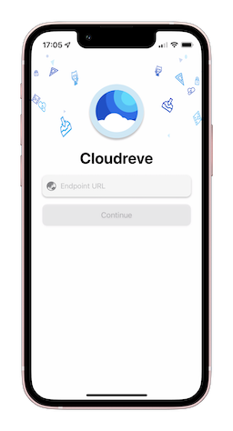
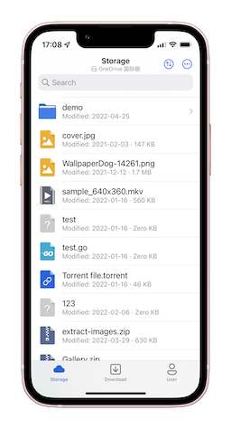
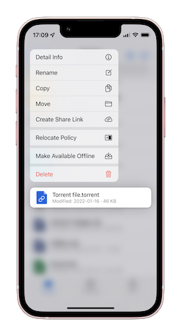

# Cloudreve iOS Client Feedback
> the alpha version registration is open, you can check [here](https://forum.cloudreve.org/d/2338)

This repo this using for track feedback for Cloudreve iOS client
You can create a new issue post if you met any bug.

# Screenshots
> click to show the high resolution image

